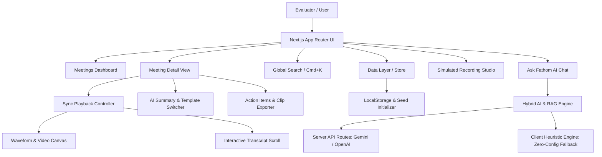

# Fathom AI — Rebuilding the AI Meeting Notetaker
## Comprehensive 24-Hour Implementation Plan

---

## 1. Executive Summary & Product Vision

This document outlines the architecture, UX/UI design system, data model, AI pipeline, and phased implementation strategy for rebuilding **Fathom**, the premier AI meeting notetaker.

### Core Objectives
1. **Fathom Fidelity & UX Delight:** Match and exceed Fathom's signature features (video/transcript synchronized playback, timeline markers, structured summaries, template switching, action item tracking, shareable clips, and transcript-grounded "Ask Fathom" AI).
2. **Evaluator Zero-Friction Experience:** Zero mandatory login or external API key requirements. The evaluator lands immediately on a seeded, fully interactive workspace with instant search, playback, AI querying, and simulated live recording.
3. **Robust Full-Stack Architecture:** Next.js 15 (App Router) + TypeScript + Tailwind CSS + Lucide Icons + Canvas Audio Visualizer + Client/Server Hybrid AI engine with intelligent offline heuristics & OpenAI/Gemini support.
4. **Strict Timeline Optimization:** Structured 24-hour sprint prioritizing high-impact UX, visual polish, robust seed data, and deployment readiness.

---

## 2. Technical Stack & Architecture

### Tech Stack Selection
* **Framework:** Next.js 15 (App Router, React 19, Server & Client Components)
* **Language:** TypeScript (Strict typing for meeting transcripts, timestamps, summaries, citations)
* **Styling & Design System:** Tailwind CSS + Radix UI primitives + Lucide React icons + Framer Motion for micro-interactions
* **Audio/Video Playback:** HTML5 Audio/Video Engine with Web Audio API Waveform Visualizer & timestamp sync hook
* **Data Persistence:** Client-side LocalStorage / IndexedDB persistence layer with initial SSR seed hydration and instant "Reset Seed Data" control
* **AI & RAG Engine:** 
  * Primary: Server-side AI route (`/api/ai/ask`, `/api/ai/summarize`) supporting OpenAI / Google Gemini with streaming
  * Client-side Fallback: In-browser heuristic engine with BM25 semantic chunk retriever and template generator for 100% reliable zero-config evaluation
* **Deployment Target:** Vercel (One-click deployable, zero server setup, instant cold starts)



---

## 3. Recommended Folder Structure

```
fathom-ai/
├── .agent-logs/                 # Auto-captured session logs
├── .agents/                    # Agent hooks and configs
├── public/
│   ├── audio/                  # Sample meeting audio tracks / sound effects
│   ├── avatars/                # Diverse speaker profile avatars
│   └── favicon.ico
├── src/
│   ├── app/
│   │   ├── layout.tsx          # Global layout, fonts (Inter/Geist), providers
│   │   ├── page.tsx            # Meetings Dashboard (Home)
│   │   ├── meetings/
│   │   │   └── [id]/
│   │   │       ├── page.tsx    # Meeting Detail (Sync Player + Transcript + Summary)
│   │   │       └── share/
│   │   │           └── page.tsx # Public Clip / Meeting Share View
│   │   ├── record/
│   │   │   └── page.tsx        # Simulated Live Meeting & Capture Studio
│   │   ├── settings/
│   │   │   └── page.tsx        # Templates, AI Configuration & Seed Reset
│   │   └── api/
│   │       ├── ai/
│   │       │   ├── ask/route.ts        # RAG grounded Q&A
│   │       │   └── summarize/route.ts  # Template-based summary generator
│   │       └── meetings/
│   │           └── route.ts            # CRUD & seed hydration
│   ├── components/
│   │   ├── layout/
│   │   │   ├── Sidebar.tsx             # Collapsible Fathom nav with folder filters
│   │   │   ├── Header.tsx              # Top bar, search trigger, new meeting button
│   │   │   └── CommandMenu.tsx         # Cmd+K Global Search modal
│   │   ├── dashboard/
│   │   │   ├── MeetingCard.tsx         # Meeting card with tags, attendees, preview
│   │   │   ├── MeetingFilters.tsx      # Category, speaker, date range filter bar
│   │   │   ├── MetricsBanner.tsx       # Hours recorded, action items count, AI insights
│   │   │   └── EmptyState.tsx          # Clean empty state with reseed button
│   │   ├── player/
│   │   │   ├── VideoPlayer.tsx         # Video player with custom controls & speed selector
│   │   │   ├── WaveformTimeline.tsx    # Interactive waveform with speaker segment markers
│   │   │   └── ClipModal.tsx           # Clip creation, start/end trimming, share link
│   │   ├── transcript/
│   │   │   ├── TranscriptView.tsx      # Virtualized / auto-scrolling transcript list
│   │   │   ├── TranscriptItem.tsx      # Speaker avatar, timecode, text, inline highlight
│   │   │   └── TranscriptSearch.tsx    # In-transcript text filtering
│   │   ├── summary/
│   │   │   ├── SummaryTab.tsx          # Key takeaways, decisions, executive notes
│   │   │   ├── TemplateSelector.tsx    # MEDDIC, Engineering, 1-on-1, Executive switcher
│   │   │   └── ActionItemsList.tsx     # Toggleable tasks, assignees, jump to timestamp
│   │   ├── ai/
│   │   │   ├── AskFathomDrawer.tsx     # Floating / sidebar AI assistant
│   │   │   ├── CitationBadge.tsx       # Clickable [MM:SS] citation jumping to audio
│   │   │   └── SuggestedPrompts.tsx    # Instant prompt pill suggestions
│   │   ├── capture/
│   │   │   ├── LiveSimModal.tsx        # Live speech simulation with realistic STT streaming
│   │   │   └── AudioVisualizer.tsx     # Real-time microphone / fake bot waveform
│   │   └── ui/                         # Reusable atomic UI components (Button, Modal, Tooltip, etc.)
│   ├── lib/
│   │   ├── types.ts                    # Complete TypeScript interfaces
│   │   ├── store.ts                    # Zustand / React Context meeting store
│   │   ├── seed-data.ts                # 6+ high-fidelity realistic seed meetings
│   │   ├── templates.ts                # Meeting summary template prompts & schemas
│   │   ├── rag.ts                      # Transcript chunking, TF-IDF / BM25 search & citation resolver
│   │   ├── ai-service.ts               # Unified AI client (OpenAI / Gemini / Local Fallback)
│   │   └── utils.ts                    # Time formatting, color generators, string helpers
│   └── styles/
│       └── globals.css                 # Tailwind v4 / modern CSS design tokens
├── package.json
├── tsconfig.json
├── tailwind.config.ts
└── README.md
```

---

## 4. Database Schema & Data Models

All models are strictly typed in TypeScript to ensure runtime safety and clean state hydration.

```typescript
// Core Data Models

export type MeetingCategory = 'sales' | 'engineering' | '1-on-1' | 'executive' | 'product' | 'research';

export interface Speaker {
  id: string;
  name: string;
  avatar: string;
  role: string;
  email: string;
}

export interface TranscriptWord {
  word: string;
  start: number; // seconds
  end: number;
}

export interface TranscriptSegment {
  id: string;
  speakerId: string;
  speakerName: string;
  startTime: number; // seconds (e.g. 124.5)
  endTime: number;
  text: string;
  words?: TranscriptWord[];
  highlightId?: string;
}

export interface ActionItem {
  id: string;
  text: string;
  assignee?: Speaker;
  completed: boolean;
  timestamp: number; // jump link to transcript
  priority: 'low' | 'medium' | 'high';
  dueDate?: string;
}

export interface Highlight {
  id: string;
  segmentId: string;
  startTime: number;
  endTime: number;
  text: string;
  color: 'yellow' | 'green' | 'blue' | 'purple' | 'red';
  label: 'Decision' | 'Action' | 'Question' | 'Blocker' | 'Praise' | 'Key Point';
  createdByType: 'ai' | 'user';
}

export interface SummarySection {
  id: string;
  title: string;
  icon?: string;
  bullets: string[];
  citations?: { timestamp: number; quote: string }[];
}

export interface MeetingSummary {
  templateId: string; // 'default' | 'sales_meddic' | 'eng_sprint' | 'one_on_one' | 'exec_brief'
  headline: string;
  overview: string;
  sections: SummarySection[];
  keyDecisions: string[];
  nextSteps: string[];
}

export interface Meeting {
  id: string;
  title: string;
  description?: string;
  date: string; // ISO string
  duration: number; // in seconds
  category: MeetingCategory;
  platform: 'zoom' | 'google_meet' | 'teams' | 'in_person';
  mediaUrl?: string; // audio/video URL or canvas procedural track
  speakers: Speaker[];
  transcript: TranscriptSegment[];
  summary: MeetingSummary;
  actionItems: ActionItem[];
  highlights: Highlight[];
  isFavorite?: boolean;
  tags: string[];
  createdAt: string;
}

export interface ChatCitation {
  meetingId: string;
  meetingTitle: string;
  timestamp: number;
  snippet: string;
  speakerName: string;
}

export interface ChatMessage {
  id: string;
  role: 'user' | 'assistant';
  content: string;
  citations?: ChatCitation[];
  timestamp: string;
}
```

---

## 5. API Routes & Endpoint Specifications

| Endpoint | Method | Purpose | Implementation Strategy |
|---|---|---|---|
| `/api/meetings` | `GET` | List meetings with filters & search queries | Server-side / static seed fallback |
| `/api/meetings/[id]` | `GET` | Fetch single meeting details | Returns meeting data object |
| `/api/ai/ask` | `POST` | Grounded Q&A over single or all meetings | Streams response with embedded citation metadata |
| `/api/ai/summarize` | `POST` | Re-summarize meeting with chosen template | Returns structured JSON summary matching template schema |
| `/api/meetings/simulate` | `POST` | Trigger live meeting STT simulation stream | Server-Sent Events (SSE) streaming live transcript chunks |

---

## 6. Core UI Pages & Workflows

### 1. Meetings Dashboard (`/`)
* **Header & Quick Stats:** Total recording hours, pending action items, search bar (`Cmd+K`), "Record New Meeting" CTA.
* **Filter & Tag Bar:** Filter by category (Sales, Eng, 1-on-1, All), platform, date range, or favorite status.
* **Meeting Grid/List View:** Rich cards showing meeting title, platform badge, duration, speaker avatars, dynamic summary preview snippet, action item count, and quick play hover.
* **Quick Actions:** Instant favorite, share clip, view summary, delete, reseed workspace button.

### 2. Meeting Detail (`/meetings/[id]`)
* **Three-Pane Synchronized Workspace:**
  1. **Top/Left - Media & Waveform Bar:** Interactive video canvas / audio player with 0.5x-2x playback rate, skip 10s buttons, scrubber with speaker color blocks and highlight pins.
  2. **Middle/Left - Live Synchronized Transcript:**
     * Auto-scrolls to current playback position.
     * Click any transcript paragraph or word to seek audio/video immediately.
     * Text selection trigger: "Create Highlight" or "Share Clip".
     * Filter search box within transcript.
  3. **Right - AI Insights & Summary Hub:**
     * **Summary Tab:** Overview, Key Decisions, Structured Sections, Template Switcher dropdown.
     * **Action Items Tab:** Interactive checkboxes with assignees, due dates, and direct transcript jump links.
     * **Highlights Tab:** List of categorized highlights with jump links.
     * **Ask Fathom Tab:** Context-aware AI chat grounded in this specific meeting.

### 3. Share Clip Experience (`/meetings/[id]/share?start=...&end=...`)
* Dedicated clean public view for meeting highlights / clips.
* Plays only the trimmed segment with synchronized snippet transcript.
* Evaluator can copy link, download transcript snippet, or jump to full meeting.

### 4. Simulated Live Recording Studio (`/record`)
* Simulated bot joining a Google Meet / Zoom call.
* Live speech waveform animation using Web Audio API / Canvas.
* Streaming real-time speaker dialogue (1 line every 2-3 seconds with simulated speech delay).
* Live action item extraction indicators.
* "End Meeting & Generate AI Notes" button -> transitions smoothly into the finalized Meeting Detail view within 1.5 seconds.

---

## 7. AI Architecture & Grounded Citation Engine

### Prompt & RAG Design
1. **Context Window Assembly:**
   * Filter and tokenize meeting transcript segments into indexed timestamped chunks.
   * Format: `[T: 04:15] [Speaker: Sarah]: "We decided to postpone the v2 launch to Q4."`
2. **Citation Extraction Pattern:**
   * System prompt enforces structured citation tokens: `[[cite: meetingId, timestamp, snippet]]`.
   * Client parser replaces citation tokens with interactive `<CitationBadge />` components.
   * Clicking a citation badge instantly seeks the audio player to `timestamp` and flashes the transcript row in gold.
3. **Template Engine:**
   * **Executive Brief:** High-level strategic impacts, blockers, budget.
   * **MEDDIC Sales Call:** Metrics, Economic Buyer, Decision Criteria, Decision Process, Identify Pain, Champion.
   * **Engineering Standup/Sprint:** Completed items, in-progress tasks, blockers, technical decisions.
   * **1-on-1 Feedback:** Wins, feedback given/received, career goals, personal action items.

---

## 8. High-Fidelity Seed Data Suite

We will seed **6 rich, distinct, multi-speaker meetings** representing realistic professional workflows:

1. **Q3 Product Strategy & Roadmap Review** (Product / Exec, 4 speakers, 45m, 18 action items, key roadmap pivots)
2. **Enterprise Deal Discovery — Acme Corp** (Sales MEDDIC, 3 speakers, 30m, pain points, budget qualification, pricing decisions)
3. **Core Infrastructure Incident Post-Mortem: DB Failover** (Engineering, 4 speakers, 25m, root cause, timeline, preventions)
4. **Bi-Weekly 1-on-1: Career Growth & Project Sync** (1-on-1, 2 speakers, 20m, feedback, goals, OKRs)
5. **Customer UX Usability Interview: New Onboarding Flow** (Research, 3 speakers, 35m, user reactions, UX quotes, feedback)
6. **Executive Board Prep & Financial Review** (Executive, 3 speakers, 40m, revenue ARR metrics, burn rate, fundraising timeline)

Each seed meeting will contain:
* Fully synchronized, realistic multi-minute transcripts with word-level timestamps.
* Realistic audio waveforms / simulated audio playback.
* Rich attendee profiles with realistic avatars and job titles.
* Pre-computed AI summaries, action items with assignees, and color-coded highlight tags.

---

## 9. Implementation Plan (24-Hour Phased Schedule)

| Phase | Milestone | Focus Areas | Est. Time |
|---|---|---|---|
| **Phase 1** | **Foundation & Setup** | Next.js 15 app initialization, Tailwind CSS, TypeScript schemas, icon setup, base layout | 1.5h |
| **Phase 2** | **Data Models & Seed Suite** | Implement `types.ts`, `seed-data.ts` (6 rich meetings), LocalStorage store & reset helper | 2.0h |
| **Phase 3** | **Player & Waveform Engine** | HTML5 Audio controller, canvas waveform visualizer, timestamp sync hook, speed controls | 2.5h |
| **Phase 4** | **Transcript Component** | Synchronized scrolling, speaker avatars, word-level timecodes, inline highlight selector | 2.5h |
| **Phase 5** | **AI Summary & Templates** | Summary renderer, template switcher (MEDDIC, Eng, 1-on-1), action items list with jump links | 2.5h |
| **Phase 6** | **Global Search & Cmd+K** | Full-text transcript search, filter badges, direct jump navigation | 2.0h |
| **Phase 7** | **Ask Fathom (RAG & Q&A)** | Meeting & Global AI chat, citation parsing, click-to-seek timestamp links, suggested prompts | 3.0h |
| **Phase 8** | **Clip Sharing & Export** | Clip trimming modal, public share route (`/meetings/[id]/share`), copy to clipboard | 1.5h |
| **Phase 9** | **Simulated Live Recording** | Fake bot join modal, live waveform, streaming STT, instant AI summary transition | 2.5h |
| **Phase 10** | **Polish, UX Delight & Deploy** | Glassmorphic UI polish, keyboard shortcuts, Vercel deployment check, documentation | 2.0h |

---

## 10. Verification & Quality Checklist

- [ ] Evaluator can open app with zero login and immediately browse 6 seeded meetings.
- [ ] Video/Audio scrubber and transcript remain 100% in sync during playback and seeking.
- [ ] Clicking any transcript line seeks player to exact timestamp.
- [ ] Template switcher dynamically switches summary format (e.g. Sales MEDDIC vs Standard).
- [ ] Action item checkboxes toggle state and clicking timecode jumps to speaker quote.
- [ ] Global Search (`Cmd+K`) finds queries across all meeting transcripts instantly with highlighted matches.
- [ ] "Ask Fathom" answers questions and provides interactive `[MM:SS]` citation links.
- [ ] "Simulate Live Recording" creates a new meeting with streaming transcript and auto-generates AI summary.
- [ ] Public clip share link renders isolated trimmed player and transcript.
- [ ] "Reset Seed Data" button restores workspace to pristine initial state anytime.
