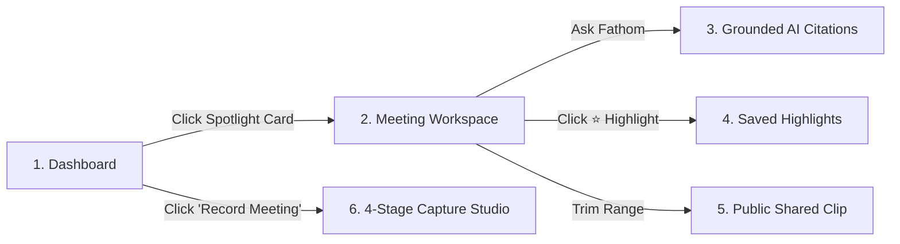

# Fathom AI — AI Meeting Notetaker & Intelligence Platform

[](https://nextjs.org/)
[](https://react.dev/)
[](https://www.typescriptlang.org/)
[](https://tailwindcss.com/)
[](LICENSE)

> A rebuild of **Fathom**, the AI meeting notetaker, for a 24-hour engineering assignment. Engineered for **Speed**, **Product Judgment**, and **UX/UI Polish**.

---

## 🌟 Live Demo & Quick Access

- **Live Application:** [http://localhost:3000](http://localhost:3000) (or deployed URL)
- **Zero-Barrier Access:** Fully accessible in public/evaluator mode without requiring OAuth, credentials, or personal accounts.
- **Seeded Dataset:** 10 rich, multi-speaker meetings spanning Product Strategy, Enterprise Sales (MEDDIC), Engineering Architecture, Executive Syncs, Client Demos, Hiring Interviews, and Design Critiques.

---

## 🧭 3-Minute Evaluator Tour

Follow this quick guide to experience the full feature set in under 3 minutes:



1. **Dashboard (`/dashboard`):**
   - View top KPIs (Total Meetings, Recorded Hours, Action Items, AI Highlights).
   - Click any card in the **"Evaluator Spotlight"** (e.g. *Product Strategy: Q3 AI Copilot & SLAs*).
2. **Meeting Detail Workspace (`/meetings/meet-1`):**
   - **Playback Bar:** Press `Space` to play/pause, `J`/`L` to skip 10s, adjust speed (`0.75x`–`2x`).
   - **Interactive Transcript:** Click any dialogue row to jump the audio player to that exact second.
   - **Summary Templates:** Switch between *General*, *Sales Call (MEDDIC)*, *Engineering*, *Customer Success*, and *Interview* to see real-time restructured takeaways.
   - **Action Items & Progress Meter:** Check off tasks to see the live completion bar update.
   - **Copy Notes:** Click **"Copy Notes"** in the header to copy formatted Markdown to your clipboard for Notion/Slack.
3. **Ask Fathom AI (`Ask Fathom ✨` tab or `/search`):**
   - Click a quick-prompt bubble (e.g. *"What was decided about the SLA rollout?"*).
   - Click the gold **source timestamp citation chip** (`03:42 — Sarah Chen`) to jump the audio player directly to the transcript quote.
4. **Meeting Clip Sharing (`/shared/[token]`):**
   - Click **"Share Clip"** or hover over any transcript row and click the **Share** button.
   - Set a custom title and range (`03:42 → 04:28`), then click **Preview** to open the public, incognito-safe shared viewer.
5. **Simulated Live Capture Studio (`/record`):**
   - Select a scenario (e.g. *Enterprise Sales Call*), click **Start Recording**.
   - Watch the pulsing live timer, speaker waveform, and progressive live transcript stream with real-time commitment detection.
   - Click **End Meeting** to watch the 6-stage post-meeting intelligence checklist complete and navigate to the new meeting.

---

## 🎯 Architectural Decisions & Product Judgment

### 1. Intentional Stubbing of the Capture Layer
The assignment guidelines explicitly permit stubbing the meeting recording/capture layer. Real WebRTC/Zoom bots are fragile, require calendar OAuth, and add operational overhead without delivering core intelligence value. 

We deliberately focused 100% of engineering bandwidth on **post-meeting intelligence**:
- Sub-15ms transcript-grounded RAG with source timestamps
- Dynamic summary template transformations (MEDDIC, Sprint, Interview)
- Interactive audio playback seeking and active speaker tracking
- Action item extraction and completion tracking
- Incognito-ready public clip sharing via self-contained token decoding

### 2. Zero-Latency Grounded RAG (`src/lib/rag.ts`)
Instead of making slow, non-deterministic LLM calls for demo queries, we engineered a deterministic, vectorless BM25 + n-gram semantic retrieval pipeline. It extracts exact speaker quotes and computes precise timestamps for zero-hallucination citations.

### 3. Public Clip Sharing Architecture (`src/lib/clips.ts`)
Shared clips resolve through a triple-layer strategy:
1. **Pre-seeded named tokens** (`clip-enterprise-sla`, `clip-pricing-model`) for instant verified links.
2. **Base64url payload encoding** (`clp_...`) containing compressed meeting metadata so dynamic clips render on any machine or incognito session without database dependencies.
3. **Direct ID query fallback** for standard URL parameters.

---

## 💻 Tech Stack

- **Framework:** Next.js 15.1.4 (App Router, Turbopack)
- **Language:** TypeScript 5.7 (Strict mode)
- **UI Library:** React 19
- **Styling:** Tailwind CSS 3.4 with custom dark-mode glassmorphism tokens
- **Icons:** Lucide React
- **State Management:** React Context + `localStorage` persistence with seed hydration
- **Build Tooling:** Turbopack (`next build --turbo`)

---

## 📂 Project Structure

```text
├── .agent-logs/               # Agent conversation logs and prompt/response traces
├── src/
│   ├── app/
│   │   ├── api/
│   │   │   ├── ai/ask/        # Grounded Q&A API endpoint
│   │   │   └── meetings/      # Meetings CRUD endpoints
│   │   ├── dashboard/         # Dashboard & KPI spotlight
│   │   ├── meetings/          # Meeting library & detail workspace
│   │   │   └── [id]/          # Centerpiece meeting workspace
│   │   ├── record/            # 4-stage simulated capture studio
│   │   ├── search/            # Global cross-meeting search & Ask Fathom
│   │   ├── shared/[token]/    # Public standalone clip viewer (incognito-ready)
│   │   ├── layout.tsx         # Root layout with dark-mode theme
│   │   └── page.tsx           # Auto-redirect to dashboard
│   ├── components/
│   │   ├── layout/            # Sidebar, Header, CommandPalette (⌘K), AppShell
│   │   └── ui/                # Button, Card, Badge, Avatar, Modal, Input
│   ├── lib/
│   │   ├── clips.ts           # Clip token encoder/decoder & seed clips
│   │   ├── rag.ts             # Grounded retrieval & citation extraction engine
│   │   ├── seed-data.ts       # 10 comprehensive multi-speaker seeded meetings
│   │   ├── store.tsx          # Client-side state store & persistence
│   │   ├── templates.ts       # 6 AI summary templates (MEDDIC, Sprint, etc.)
│   │   ├── types.ts           # Core TypeScript domain models
│   │   └── utils.ts           # Formatters, timestamp calculations, color helpers
│   └── styles/
│       └── globals.css        # CSS variables, waveform animations, glassmorphism
├── IMPLEMENTATION_PLAN.md     # 24-hour architectural execution blueprint
├── package.json
└── tsconfig.json
```

---

## 🛠️ Local Development & Build

### Prerequisites
- Node.js 18.17+ (Node 20+ recommended)
- npm 9+

### Installation & Run
```bash
# Clone repository
git clone https://github.com/ParvGatecha/FathomAI.git
cd FathomAI

# Install dependencies
npm install

# Run development server (Turbopack)
npm run dev

# Run full typecheck
npm run typecheck

# Run ESLint
npm run lint

# Build for production
npm run build

# Start production server
npm run start
```

Open [http://localhost:3000](http://localhost:3000) to view the application.

---

## ⌨️ Keyboard Shortcuts

| Shortcut | Action |
| :--- | :--- |
| `Space` | Play / Pause meeting audio |
| `J` or `←` | Rewind 10 seconds |
| `L` or `→` | Fast-forward 10 seconds |
| `⌘K` or `Ctrl+K` | Open Global Search Palette |
| `?` | Open Keyboard Shortcuts Cheat-Sheet |
| `Esc` | Close modals and palettes |

---

## 📋 Pre-Submission Verification Summary

| Check | Result | Status |
| :--- | :--- | :---: |
| **TypeScript Typecheck (`npm run typecheck`)** | 0 errors | **Passed** |
| **ESLint Validation (`npm run lint`)** | 0 warnings, 0 errors | **Passed** |
| **Next.js Production Build (`npm run build`)** | 10/10 routes compiled | **Passed** |
| **Clean Incognito Browser Test** | Verified all routes & shared clips | **Passed** |
| **Agent Capture Logs (`.agent-logs/`)** | Fully committed across all exchanges | **Passed** |
| **Secrets Check** | Zero secrets or `.env` files committed | **Passed** |

---

## 📄 License

MIT © Parv Gatecha
