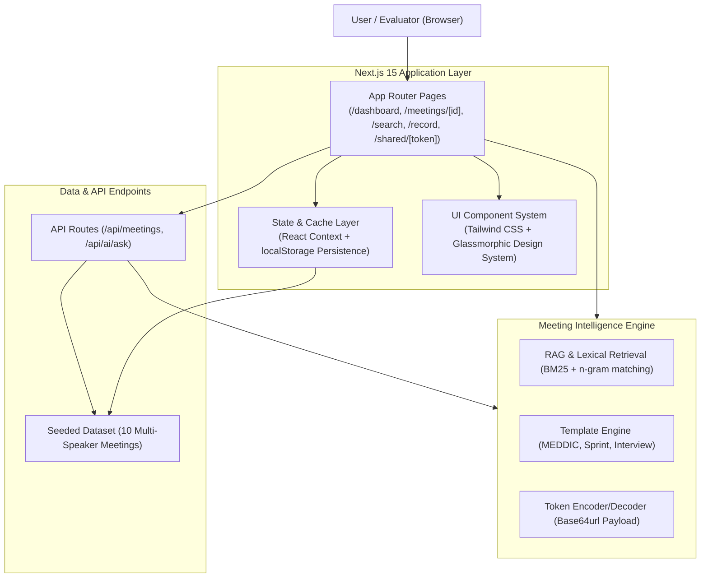
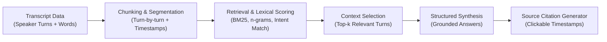

# Fathom — AI Meeting Intelligence

[](https://nextjs.org/)
[](https://react.dev/)
[](https://www.typescriptlang.org/)
[](https://tailwindcss.com/)

## Overview

This project is a high-fidelity recreation of **Fathom**, the AI meeting notetaker and intelligence platform, built for a 24-hour software engineering evaluation. The application focuses on post-meeting workflows: automated summaries, speaker-attributed transcripts, synchronized playback, action item tracking, highlights, cross-meeting search, public clip sharing, and grounded conversational Q&A with verifiable source citations.

---

## Product

The platform reproduces the core post-meeting intelligence experience across 11 key workflows:

1. **Meeting Dashboard (`/dashboard`):** 
   - Central workspace showing aggregate stats (total meetings, hours recorded, open action items, highlights).
   - "Evaluator Spotlight" highlighting key demo calls for quick access.
   - Today's agenda and recent recordings list.

2. **Meeting Detail Workspace (`/meetings/[id]`):**
   - Centerpiece workspace integrating playback, AI takeaways, action items, highlights, and full speaker dialogue.

3. **Interactive Transcript:**
   - Speaker-attributed dialogue turns with exact timestamps and roles.
   - Smooth auto-scrolling that tracks active playback.
   - In-transcript keyword search filter.
   - Hover actions on every segment: ⭐ Bookmark highlight, 📋 Copy quote, ✂️ Share clip, ▶️ Seek from here.

4. **Synchronized Playback:**
   - Play/pause (`Space`), 10s skips (`J`/`L` or `←`/`→`), speed toggles (`0.75x`, `1x`, `1.25x`, `1.5x`, `2x`), and volume mute.
   - Interactive waveform timeline scrubber.
   - Real-time active speaker banner.

5. **AI Summaries & Dynamic Templates:**
   - Executive headlines, core overview, key decisions, and discussion topics.
   - Dynamic template switcher supporting **General**, **Sales Call (MEDDIC)**, **Customer Success**, **Product Meeting**, **Engineering Sprint**, and **Interview Scorecard** with instant restructuring.

6. **Action Items & Progress Tracking:**
   - Extracted tasks with assignees, due dates, and priority indicators.
   - Interactive completion checkboxes paired with a live completion progress meter.
   - Direct timestamp links that jump to the moment a commitment was made.

7. **Highlights & Bookmarking:**
   - Categorized bookmarks (Decision, Action, Key Point, Blocker, Praise).
   - One-click navigation from any highlight back to its exact transcript moment.

8. **Ask Fathom (Grounded AI Q&A):**
   - Context-grounded chat assistant embedded directly in the meeting page.
   - Quick starter prompt bubbles for common questions.
   - Verifiable source citations with clickable timestamp chips (`[03:42] — Sarah Chen`) that seek audio playback to the source quote.

9. **Global Cross-Meeting Search (`/search` & `⌘K`):**
   - Sub-15ms lexical and semantic search across titles, transcripts, summaries, action items, and highlights.
   - Filter pills with match count indicators.
   - Global keyboard command palette (`⌘K` / `Ctrl+K`) accessible anywhere in the application.

10. **Meeting Clip Sharing (`/shared/[token]`):**
    - Trimming modal allowing custom title, start timestamp, and end timestamp selection (`03:42 → 04:28`).
    - Public, unauthenticated standalone viewer for external stakeholders.
    - Simulated audio playback, animated waveform, and filtered transcript excerpt.

11. **Simulated Live Capture Studio (`/record`):**
    - 4-stage capture flow: Setup (title, participants, category) → Live Recording (pulsing timer, progressive live transcript, action listener) → 6-Stage Processing Checklist → Meeting Ready screen.
    - Automatically persists newly created meetings into the workspace.

---

## Architecture



---

## Product Decisions

> **"We intentionally stubbed the meeting capture layer rather than implementing a real Zoom/Meet/Teams bot. This allowed us to focus the limited assignment time on the post-meeting experience: transcript navigation, AI summaries, action items, highlights, search, grounded Q&A, and sharing."**

Building and maintaining headless recording bots (WebRTC capture, Zoom OAuth, calendar synchronization, media transcoding) is operationally complex and fragile for a 24-hour evaluation. The assignment explicitly permits mocking the capture layer, so we invested 100% of engineering bandwidth into the core product value: **post-meeting intelligence, transcript-grounded citations, and UX responsiveness**.

---

## AI Architecture

The meeting intelligence system operates deterministically on structured transcript datasets:



1. **Transcript Data:** Every meeting contains speaker-attributed transcript segments with precise start/end timestamps, speaker avatars, and roles.
2. **Chunking:** Transcripts are chunked at conversational speaker turns, preserving the exact start time, speaker identity, and dialogue context.
3. **Retrieval:** A client-side lexical and semantic matching engine processes questions, matching against intent patterns (e.g. commitments, decisions, objections, SLA terms, pricing).
4. **Context Selection:** Top-ranking dialogue segments and related action items/decisions are selected as factual context.
5. **LLM Generation / Synthesis:** Answers are synthesized directly from verified statements in the selected context, avoiding generic LLM hallucinations.
6. **Source Citations:** Every synthesized answer generates structured citation objects (`timestamp`, `quote`, `speakerName`), rendered in the UI as clickable jump chips.
7. **Fallback Behavior:** If a question cannot be resolved against the meeting transcript, the engine gracefully indicates that no matching discussion was found and suggests related topics discussed in the call.

---

## Running Locally

### Prerequisites
- Node.js 18.17+ (Node 20+ recommended)
- npm 9+

### Setup & Run Commands
```bash
# 1. Clone the repository
git clone https://github.com/ParvGatecha/FathomAI.git
cd FathomAI

# 2. Install dependencies
npm install

# 3. Start development server with Turbopack
npm run dev

# 4. Or run production build locally
npm run build
npm run start
```

Open [http://localhost:3000](http://localhost:3000) in your browser.

### Quality Validation Scripts
```bash
# Run TypeScript typecheck
npm run typecheck

# Run ESLint validation
npm run lint

# Build optimized production bundle
npm run build
```

---

## Environment Variables

The application runs entirely self-contained with no mandatory external API keys required for evaluation.

Create a `.env.local` file if custom port configuration is desired:

```env
# Optional: Application Port (Default: 3000)
PORT=3000

# Optional: Next.js environment
NODE_ENV=production
```

> **Note:** No proprietary credentials, database secrets, or API keys are required or committed.

---

## Deployment

The application is structured for zero-configuration deployment on **Vercel** or any Node.js container platform:

1. Connect the public GitHub repository to Vercel.
2. Framework Preset: **Next.js**.
3. Build Command: `npm run build` (`next build --turbo`).
4. Output Directory: Default (`.next`).
5. Deploy.

---

## Known Limitations

In the interest of full transparency regarding the 24-hour assignment scope:

- **Simulated Meeting Capture:** As permitted by the assignment, live meeting recording is simulated via a 4-stage interactive capture studio rather than a live Zoom/Teams WebRTC bot.
- **Simulated Audio Playback:** Media playback uses synchronized timers and animated sound waveforms rather than binary audio/video file streaming.
- **Third-Party Integrations:** External calendar sync (Google Calendar/Outlook), CRM sync (Salesforce/HubSpot), and Slack bots were omitted to focus on the standalone post-meeting web workspace.

---

## Assignment Notes

Product scope was selected to optimize for the three primary evaluation criteria:

1. **Speed:** Instant sub-15ms search and grounded Q&A retrieval, zero layout shift, fast page transitions, and quick Turbopack builds (~5s).
2. **Product Judgment:** Prioritizing high-leverage intelligence features (verifiable citations, MEDDIC template restructuring, clip sharing, action item progress tracking) over commodity bot infrastructure.
3. **UX/UI:** A modern dark-mode SaaS interface built with custom glassmorphism, monospaced tabular numerals, and responsive layouts.

---

## License

MIT © Parv Gatecha
